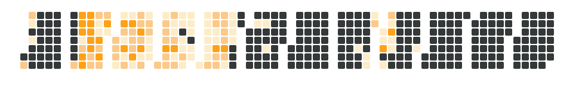

<h1 align="center">Hi there! 👋 I'm Anand Roy</h1>
<h3 align="center">Exploring the world of code @ IIT BHUBANESWAR. Welcome to my little corner of GitHub! 🚀</h3>

  

---

### ✨ What's Cooking?

*   Right now, most of my time is going into **Cookbook**.
*   Trying to make sense of **Transformers and Open-source models** (wish me luck!).
*   If you're doing cool stuff like [NostalgiaNet](https://www.nostalgianet.me/), let's chat! Always interested in similar vibes.
*   Email's usually the quickest way: **kasyapanand7@gmail.com**
*   Fun fact: If you say true after something stupid it becomes true, true;
---

### 🐾 Meet My Profile Pet! 🐾

This little pal hangs out here and updates based on my activity and your interactions!

  

  

        <!-- ACTION_LOG_START -->

 Recent Pet Interactions 

<b>Aarchi-07</b> gave me a treat 🦠— 14 days ago

<b>Aarchi-07</b> fed me 🠗 2025-07-18

<b>andycandy</b> took me on an adventure 🗺️ — 2025-07-18

<b>andycandy</b> fed me 🠗 2025-06-14

<b>andycandy</b> took me on an adventure 🗺️ — 2025-05-27

<!-- ACTION_LOG_END -->
  

#### Want to interact with the pet?

Use these buttons (or open an issue with the correct title):

  
    <!-- Add space between buttons -->
  
     <!-- Add space between buttons -->
  
  <!-- Add more buttons for other actions here -->

---

### 🏆 My GitHub Trophies & Activity

  

  

---

### 🔗 Connect With Me

  
  <!-- Add other social links/icons here if you want (LinkedIn, Twitter, etc.) -->

---
<h3 align="left">Languages and Tools:</h3>

                   

&nbsp;

